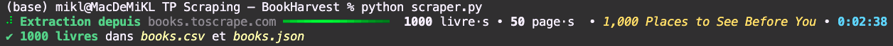

# TP Scraping — BookHarvest<a href="https://github.com/MiKL5/web-scraping/"></a>
<div align="center">

   

</div>

Script d'extraction automatisée et exhaustive du catalogue de démonstration [books.toscrape.com](https://books.toscrape.com/).
---
## Fonctionnement
Le script parcourt le catalogue page après page en suivant systématiquement le lien de pagination `<li class="next">`. L'arrêt de la boucle n'est **jamais codé en dur** : dès que ce nœud est absent du DOM de la page courante, l'itération cesse.

Pour chaque livre repéré sur une page de listing, le script suit le lien de titre vers la page de détail afin de compléter l'enregistrement (UPC, description, stock exact, image haute résolution), puis sérialise l'ensemble en `books.csv` et `books.json`.

<details>
<summary>Affichage enrichi dans le terminal</summary>

L'exécution affiche une barre de progression animée via la bibliothèque `rich` :
* Spinner animé pendant tout le scraping.
* Barre de progression colorée (dégradé personnalisable, voir `scrape_all_books`).
* Numéro de page catalogue et titre du livre en cours, affichés en temps réel.
* Temps écoulé coloré via une sous-classe dédiée (`ColoredTimeElapsedColumn`).
* Message final récapitulatif en gras vert (`bold_green`) et italique jaune doux (`italic_soft_yellow`), via des séquences ANSI portables sur macOS/Linux.

</details>

## Installation
```bash
pip install -r requirements.txt
```

<details>
<summary>Contenu de requirements.txt</summary>

```
requests>=2.32.5
beautifulsoup4>=4.15.0
rich>=14.3.3
pytest>=9.1.1
```

</details>

## Exécution
```bash
python scraper.py
```

<details>
<summary>Sortie attendue</summary>

```
1000 livres sauvegardés dans books.csv et books.json
```

<div align="center"></div>
</details>

## Tests
Le projet dispose de **deux fichiers de tests complémentaires**, à des fins différentes.
```bash
pytest test_scraper_check.py -v
```

<details>
<summary>Détail de la couverture (20 tests)</summary>

* **Extraction unitaire** (sur HTML factice, aucun appel réseau) : titre, prix, note (`star-rating`), statut de stock, miniature, URL relative, UPC, description, nombre disponible, image détail.
* **Cas limites** : description absente, compteur de stock absent.
* **Pagination** : détection et suite du lien "next", arrêt en son absence.
* **Sortie CSV** : structure du fichier généré et cohérence des 1000 lignes réelles (colonnes attendues, formats numériques, unicité des UPC, URLs absolues).

</details>
<details>
<summary><code>test_scraper_full.py</code> — suite exhaustive complémentaire (31 tests)</summary>

```bash
pytest test_scraper_full.py -v
```
Couvre aussi : la logique de retentative réseau de `fetch_html` (succès, échec, épuisement des tentatives), l'assemblage complet `scrape_book`, l'orchestration `scrape_all_books`, `save_to_json`, les utilitaires ANSI (`bold_green`, `italic_soft_yellow`) et `ColoredTimeElapsedColumn`. Inclut un test d'intégration réseau réel (limité à 2 pages de catalogue, délai réellement actif), ignoré si aucune connexion internet n'est disponible.

</details>

## Détails techniques
Aspect | Choix
:-:|---
Parsing | `beautifulsoup4` avec parseur `html.parser` intégré (aucune dépendance native supplémentaire)
Résilience réseau | `fetch_html` retente jusqu'à 3 fois avant de propager l'exception
Politesse serveur | `time.sleep(delay)` entre deux requêtes de pagination
URLs | Toujours résolues en absolu via `urllib.parse.urljoin` avant l'écriture
Affichage | `rich.progress.Progress` avec colonnes personnalisées (spinner, barre, temps écoulé coloré)

<details>
<summary>Conformité RGPD et éthique</summary>
<p>Le site `books.toscrape.com` est un bac à sable public conçu pour l'entraînement au scraping ; il ne contient aucune donnée personnelle.</p><p>Dans un contexte de production visant un site réel, il faudrait de vérifier le fichier `robots.txt`, les conditions d'utilisation (CGU), et d'appliquer un débit de requêtes raisonnable — ce que `time.sleep(delay)` illustre ici à titre de bonne pratique généralisable.</p>
</details>