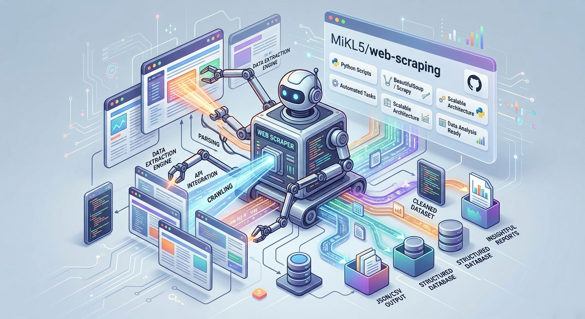

# **Web scraping**
Le web scraping est une technique consistant à extraire automatiquement des données à partir de sites web.  
Ce qui implique l'utilisation de scripts ou d'outils pour parcourir les pages web, analyser leur structure (HTML, DOM) et collecter des informations spécifiques (e.g. texte, image, lien, tableau). ​
---
## Projets avec Request & 
1. [Quotes](projects/quotes)

## Projets avec 

2. [Books](projects/books2scrape)
3. [Quotes API](projects/quotesApi)
4. [Bypass](projects/bypass)
5. [LoginQuotes](projects/loginQuotes)
6. [XHR](projects/xhr)
7. [Books to MongoDB](projects/b2mongo)
8. [FelisCrawler](projects/felisCrawler)
<!-- 9. [Geo fusion](projects/#) -->
<!-- 9. [Ariadne](projects/#)   -->
<!-- 10. [JobScraper](projects/jobScraper) -->
<!-- 11. [NewsScraper](projects/newsScraper) -->
<!-- 12. [EcommerceScraper](projects/ecommerceScraper) -->

 

<!--<kbd>_In progress_</kbd>-->