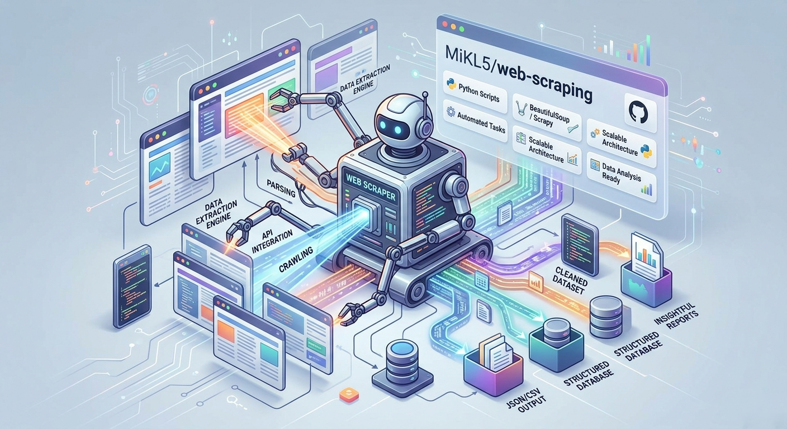

# **Data scraping & data mining**
<h3>

Le data scraping est l'extraction automatique de données<!--- du web-->.
 

L'extraction repose sur des scripts ou outils dédiés. Dans le but de parcourir les pages, d'analyser leur structure — HTML, DOM — et collecter des informations précises : texte, image, lien, tableau.

La technique s'appuie sur deux processus complémentaires.

D'abord, le crawling. Des robots, (spiders ou bots), suivent les hyperliens du<!-- web-->. Découvrant les pages pertinentes.  
Et, le scraping. Analyser la structure DOM des pages. Il en extrait des données structurées en CSV, JSON, base de données. Ces dernières alimentent l'analyse, l'agrégation ou des systèmes tiers.

ℹ️ Précision méthodologique ➜ la frontière n'est pas étanche
 

Dans la plupart des architectures, ces processus fonctionnent en pipeline, pas en silos étanches.

⚖️ Cadre légal ➜ ce n'est pas un espace de non-droit
 

Le data scraping n'est pas illégal, en droit français comme européen. Il est strictement encadré.

Le RGPD s'applique dès que la collecte porte sur des données personnelles, même publiquement accessibles. La CNIL exige alors une base légale, le plus souvent l'intérêt légitime, ainsi que des garanties de minimisation.

Le fichier robots.txt n'a pas de valeur juridiquement contraignante en droit français. Il peut néanmoins être retenu par un juge comme indice de mauvaise foi en cas de litige.

Le droit des bases de données et les conditions générales d'utilisation des sites cibles peuvent aussi restreindre la réutilisation des données extraites.

 

Le data mining désigne l'application de techniques de fouille de données<!-- du web-->.
 

Il vise à découvrir des connaissances utiles. À partir des contenus, des liens ou des usages du web. C'est une branche du data mining.

Le data mining est divisé en trois catégories.

1. Le _web content mining_.  
  Il extrait des informations depuis le contenu des pages (Texte, image, audio, vidéo, tableau).
1. Le _web structure mining_.  
  Il analyse la structure des hyperliens<!-- du web-->. Il révèle l'organisation et l'importance des pages.
1. Le _web usage mining_.  
  Il étudie les journaux de navigation des utilisateurs. Il révèle des schémas de comportement.

ℹ️ Précision méthodologique ➜ data mining et data scraping désignent deux réalités
 

Le data scraping extrait les données brutes.  
Le data mining les analyse ensuite.  
Le scraping est souvent une étape préalable au mining.

⚖️ Cadre légal ➜ le data mining n'échappe pas au RGPD
 

Le data mining n'est pas illégal. Il est en droit français comme européen soumis à un cadre strict.

Dès que les données minées sont personnelles, le RGPD s'applique. Même si ces données sont publiques. La CNIL exige alors une base légale, souvent l'intérêt légitime.

L'analyse des usages, via cookies ou logs, touche aussi la vie privée. La directive ePrivacy encadre ce traitement. Un consentement est souvent requis.

Le droit des bases de données protège certains contenus minés. Les conditions d'utilisation des sites peuvent aussi limiter leur exploitation.

</h3>

---
## Projets avec Request  & 
1. [Quotes](projects/quotes)
2. [BookHarvest](projects/TPScraping—BookHarvest)
## Projets avec 
3. [Books](projects/books2scrape)
4. [BookHarvest — Scrapy Edition](projects/TP_BookHarvest—Scrapy%20Edition)
5. [Quotes API](projects/quotesApi)
6. [Bypass](projects/bypass)
7. [LoginQuotes](projects/loginQuotes)
8. [XHR](projects/xhr)
9. [Books to MongoDB](projects/b2mongo)
10. [FelisCrawler](projects/felisCrawler)
<!-- 11. [Geo fusion](projects/#) -->
<!-- 12. [Ariadne](projects/#)   -->
<!-- 13. [JobScraper](projects/jobScraper) -->
<!-- 14. [NewsScraper](projects/newsScraper) -->
<!-- 15. [EcommerceScraper](projects/ecommerceScraper) -->

 

<!--<kbd>_In progress_</kbd>-->